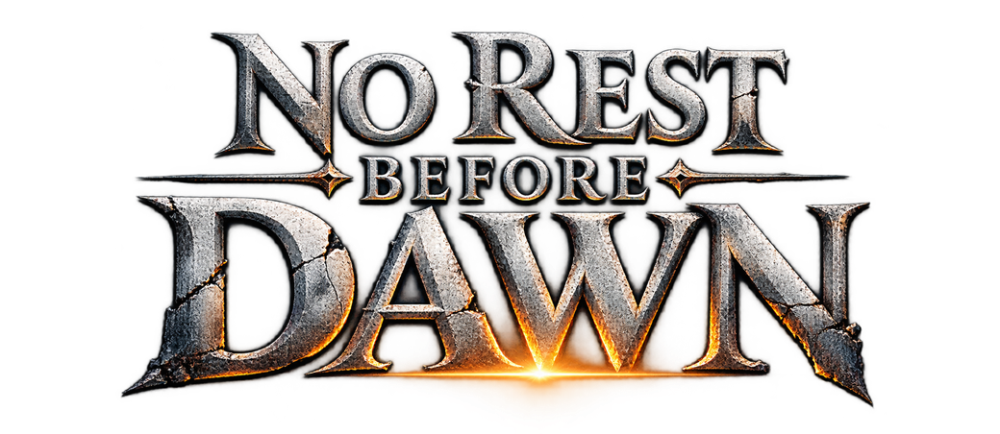
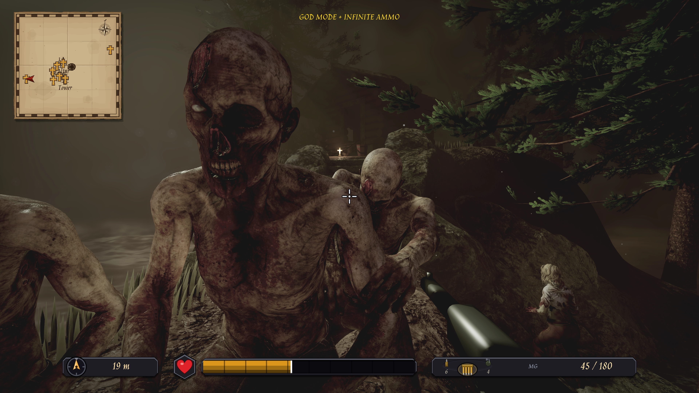

---
"First person zombie shooting game" using the [Traktor](https://github.com/apistol78/traktor) engine.

---

This an example game project used to showcase various features of the Traktor engine.
The game is also used as a testbed for new feature development thus might be
in various degree of playablity.

Most of the assets used in this game is either publically available assets or AI generated. Part of the development process for this game is for myself to learn how to make and replace assets as much as I can and have time to do so.

See the "AI USAGE AND LICENSES" for references to used assets.